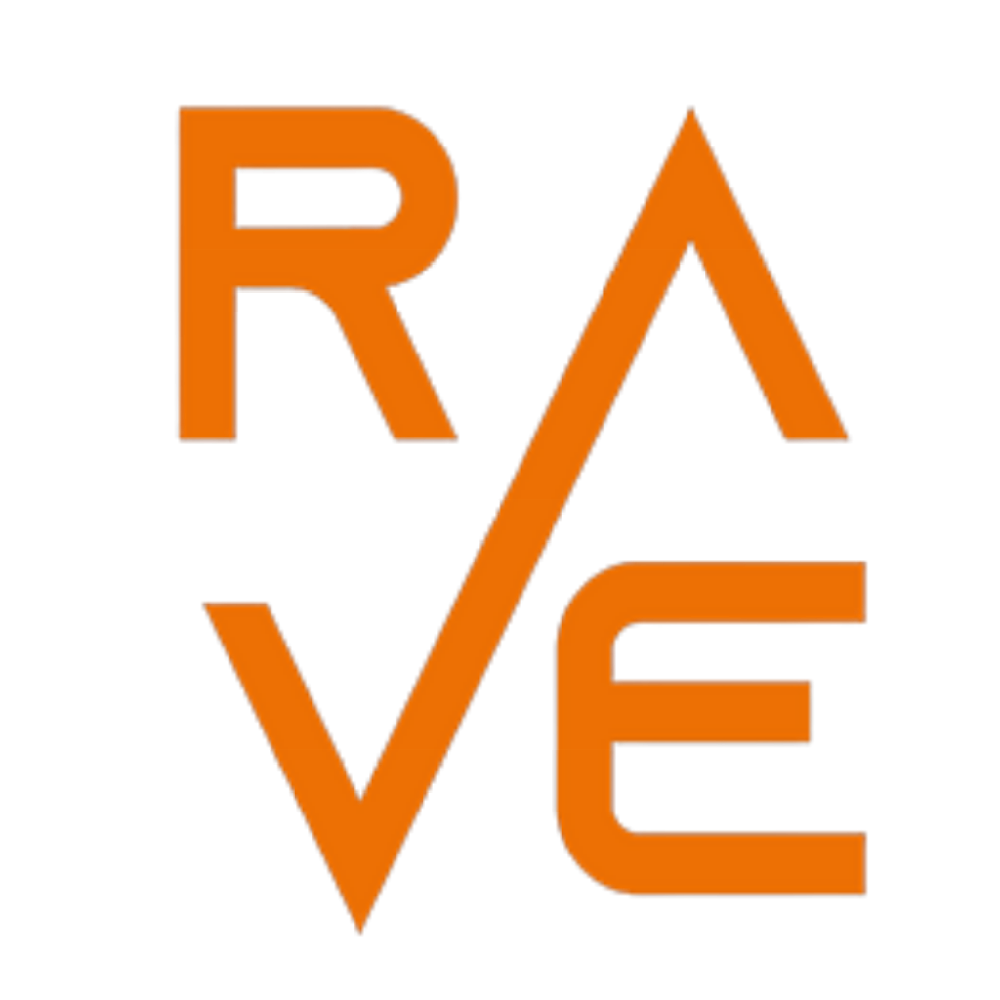

<div style="width: 100%; text-align: center;">
   
</div>

## Overview
Welcome to the Rave application frontend repository. Here, you'll find all the source code necessary for the frontend development application of Rave. The application is compatible with Android, IOS and will support web browser in future.

## Development Setup

### Prerequisites
To prepare your development environment, follow these steps:

#### General Setup
1. **Install Android Studio**: This is essential for both Android and iOS development.

2. Install **Node.js**, **npm**, and **npx**: These tools are essential for managing packages and running scripts.

#### MacOS Specific Setup
3. **Configure Android SDK and Java Directories**: Avoid errors due to whitespaces in default installation paths.
   - For Android SDK:
     ```bash
     sudo ln -s '/Users/asyacorbeau/Library/Android/sdk' '/opt/android-sdk'
     ```
   - For Java Installation:
     ```bash
     sudo ln -s '/Applications/Android Studio.app/Contents/jbr/Contents/Home' '/opt/java'
     ```

#### Environement setup
**Update Environment Variables**: Modify your `.env` file accordingly.
   ```bash
   JAVA_HOME=/opt/java
   ANDROID_HOME=/opt/android-sdk
   EXPO_PUBLIC_AUTH0_CLIENT_ID="FkPCr5W89Zn4eJpacrVBFQbZ9QrIEFDn"
   EXPO_PUBLIC_AUTH0_DOMAIN="dev-pucpqiqy6v8crnkr.us.auth0.com"
   # Url of the API server (see backend dependency)
   EXPO_PUBLIC_API_URL="http://127.0.0.1:3000/graphql"
   ```

## Development Process

### Backend Dependency
For the frontend application to function properly, it's essential that the backend is up and running. (and have your environ variable `EXPO_PUBLIC_API_URL` setup accordingly). You have two options for this:

1. **Running Locally**: If you choose to run the backend locally, ensure that it's started before initiating the frontend development server. This local setup is ideal for development and testing purposes.
    > Set `EXPO_PUBLIC_API_URL` to `http://0.0.0.0:3000` when running the app from an emulator, use your public IP address when using a real device (the device must be connected on the same wifi network).

    > See [this repository](https://github.com/asyade/rave-app-backend) for more details on how to run the backend

2. **Using a Development Server**: Alternatively, you can connect to a backend hosted on a development server. This is useful for testing in an environment that closely resembles production.

### Installing 

### Installing npm dependencies
Before you stary you must install npm dependencies by running the following commande from the root directory of this repository.
```bash
npm install .
```

### Prebuilding the Application
Prepare the application for your target device:
- For Android:
   ```bash
   npx expo prebuild --platform android
   ```
- For IOS
   ```bash
   npx expo prebuild --platform ios
   ```

### Debugging with Expo CLI
Utilize the Expo CLI for an efficient debugging experience. The tool offers hot refresh capabilities, significantly speeding up the development cycle.

#### Usage Examples
- **Start the Development Server**: This command initiates the frontend development server. Ensure that your backend (local or dev server) is running before executing this.
  ```bash
  npx expo run
  ```

- **Launch on an Android Device**: To see your application in action on an Android device, use this command. It requires an active backend and a connected device or emulator.
   ```bash
   npx expo run:android
   ```